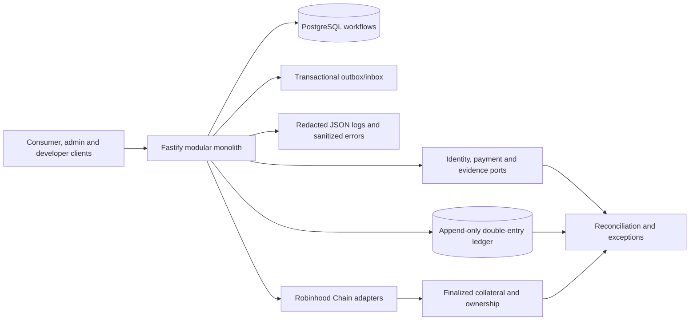

# System architecture

Afridict combines financial infrastructure with generalized prediction-market infrastructure. Binary, categorical, and scalar markets share one governed model. The planned execution stack is a deterministic CLOB, a bounded protocol AMM backstop, and institutional RFQ. Robinhood Chain is the committed settlement network.

## Authoritative state

| Fact | Authority |
| --- | --- |
| Authentication | Configured OIDC issuer and verified immutable subject |
| Roles and capability decisions | Afridict PostgreSQL policy records |
| Contact possession | Afridict normalized timestamps backed by Twilio Verify results |
| Identity-document status | Afridict normalized state backed by Persona |
| Operational workflows | PostgreSQL state machines |
| Off-chain money | Append-only Afridict double-entry ledger |
| Orders and matches | Deterministic synthetic CLOB journal |
| External NGN payment state | Reconciled Swervpay records and finance decisions |
| Final collateral and outcome ownership | Finalized Robinhood Chain state |
| Market outcome | Governed evidence/resolution record plus chain finalization |

Read models, caches, partner webhooks, RPC responses, indexers, and transaction hashes are observations. They do not replace these authorities. Differences create owned reconciliation exceptions.

## Security and integrity

All financial values use explicit assets and integer minor units. Journals balance per asset and remain append-only. One owner/asset lock serializes reservations across withdrawals and future CLOB, AMM, and RFQ paths. Commands use idempotency records, privileged actions produce audit and outbox events, and production runs with a restricted database role.

Provider SDKs and payloads terminate at adapter boundaries. Domain modules use normalized Afridict types. Secrets, OTPs, raw KYC documents, and customer data are excluded from logs, examples, analytics, and general events.

Pino emits structured operational logs with request and OpenAPI operation identifiers. Optional Sentry reporting receives sanitized exception types and stack frames plus non-customer correlation identifiers. Request bodies, headers, users, breadcrumbs, exception messages, provider payloads, and financial details are excluded from external error reports. See [ADR 0008](adr/0008-privacy-safe-operational-telemetry.md).

The modular monolith is intentional. Services are extracted only for measured latency, fault isolation, security, scaling, deployment, or ownership needs. Deterministic matching may become a separate service when workload evidence justifies it.
